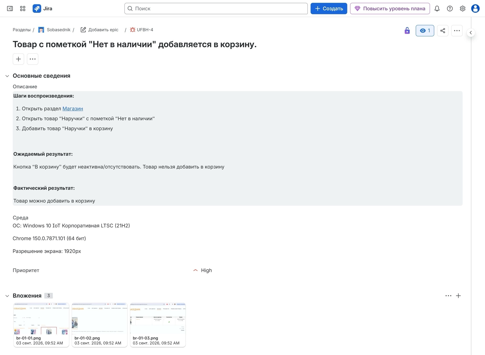
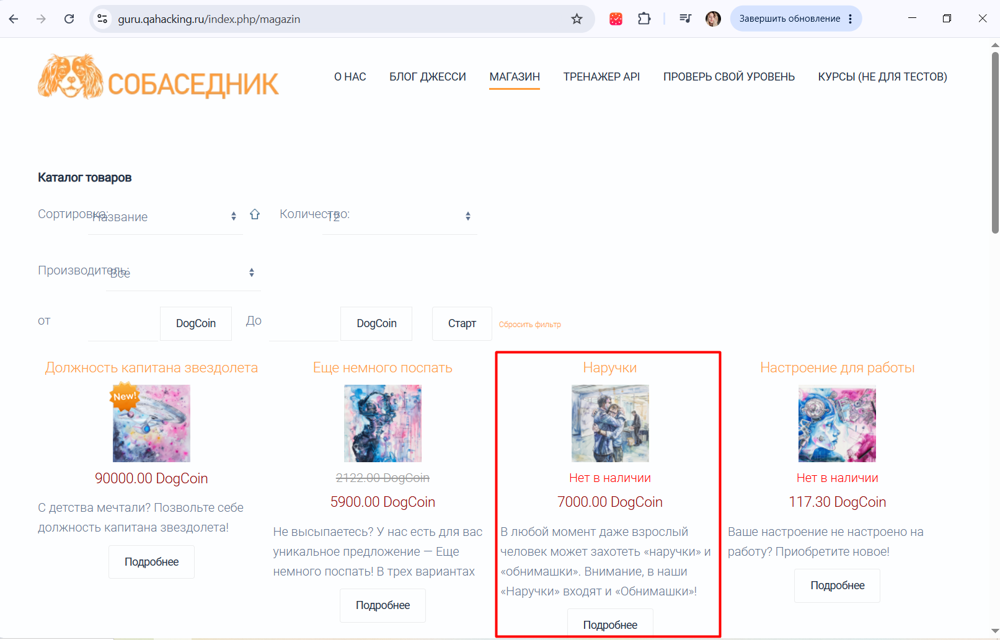
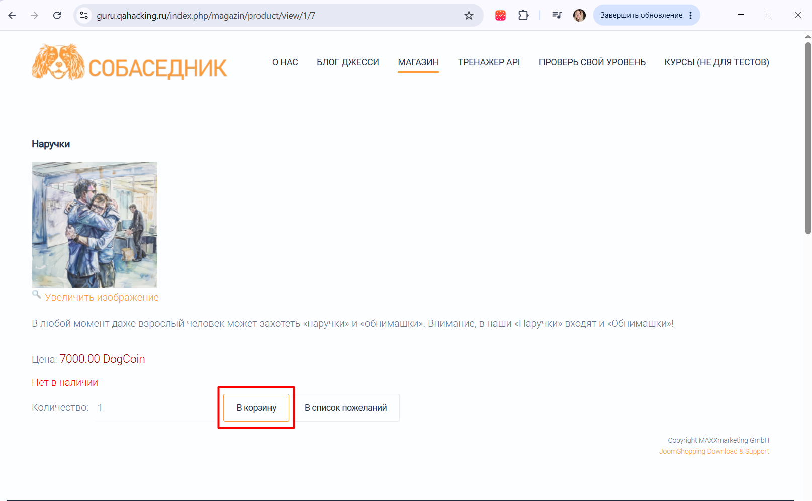
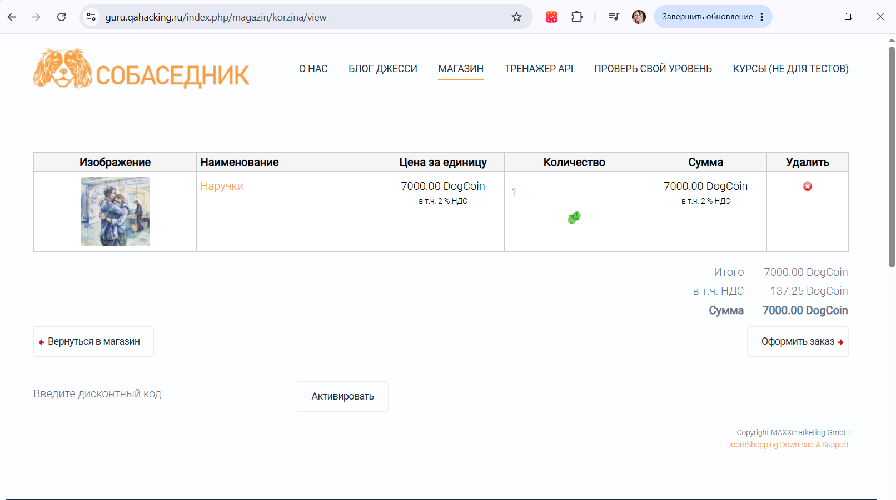

# BR-01: Товар с пометкой «Нет в наличии» добавляется в корзину

**Серьёзность:** Critical

**Приоритет:** High

**Страница:** Магазин → Карточка товара «Наручки»

**Стенд:** https://guru.qahacking.ru/index.php/magazin

**Окружение:** Windows 10 IoT Корпоративная LTSC (21H2), Chrome 150.0.7871.101 (64 бит), 1920px

**Jira:** UFBH-4

## Шаги воспроизведения

1. Открыть раздел «Магазин» — https://guru.qahacking.ru/index.php/magazin
2. Найти товар «Наручки» с пометкой «Нет в наличии»
3. Открыть карточку товара «Наручки»
4. Нажать кнопку «В корзину»

## Ожидаемый результат

Кнопка «В корзину» неактивна или отсутствует. Товар нельзя добавить в корзину.

## Фактический результат

Товар можно добавить в корзину. Кнопка «В корзину» активна и товар появляется в корзине.

## Скриншоты

Скриншот из Jira:

Магазин — товар «Наручки» со статусом «Нет в наличии»:

Карточка товара — кнопка «В корзину» активна:

Корзина — товар добавлен:

