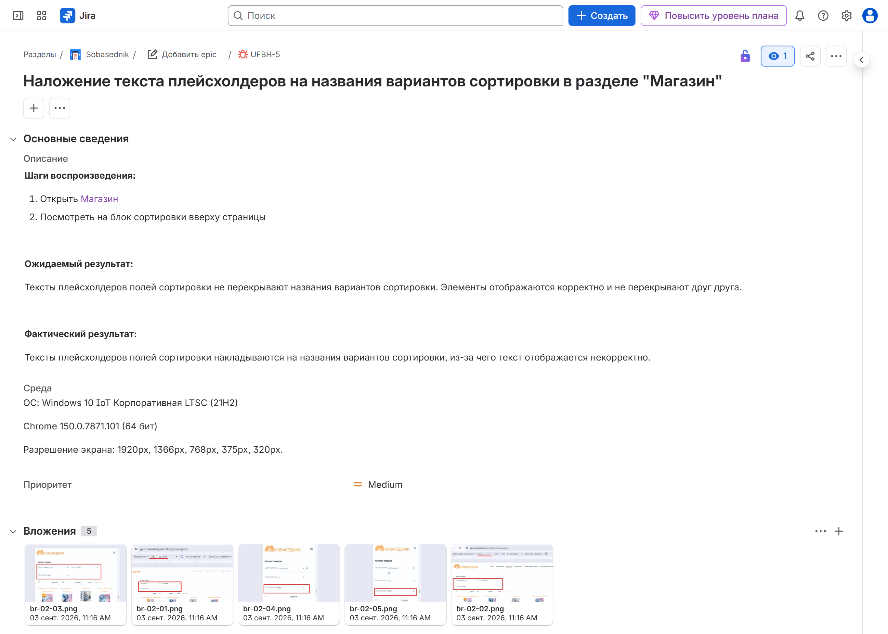
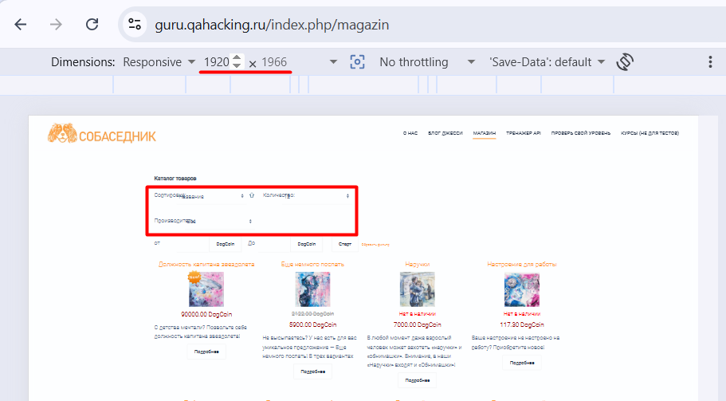
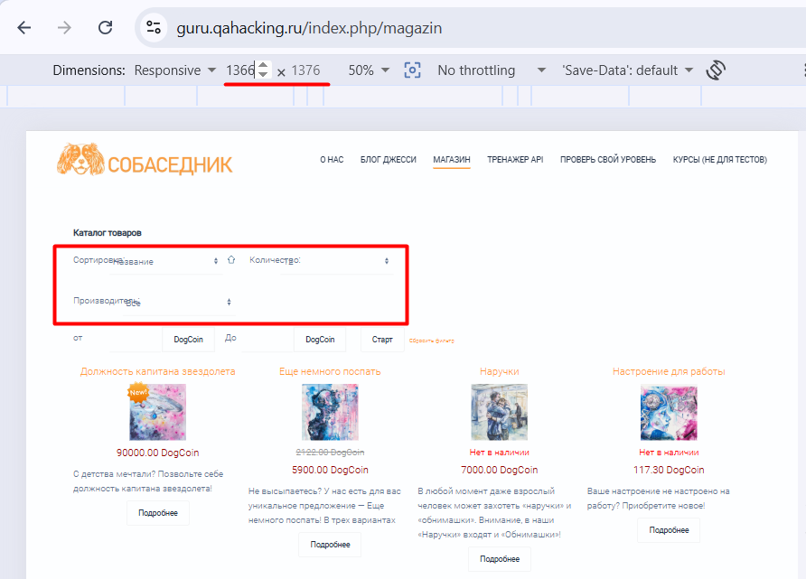
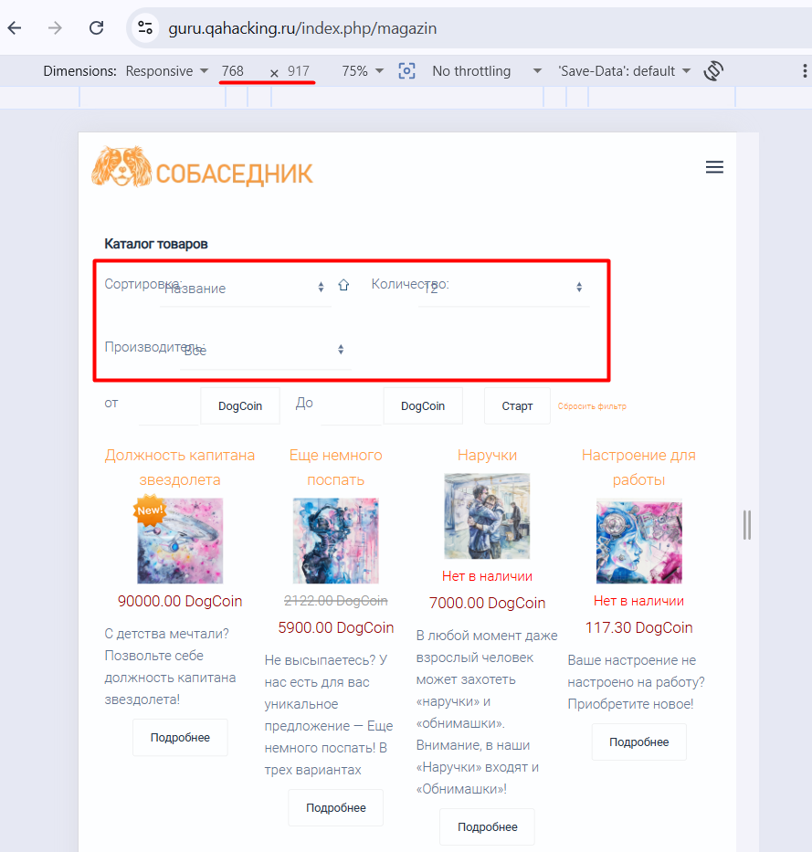
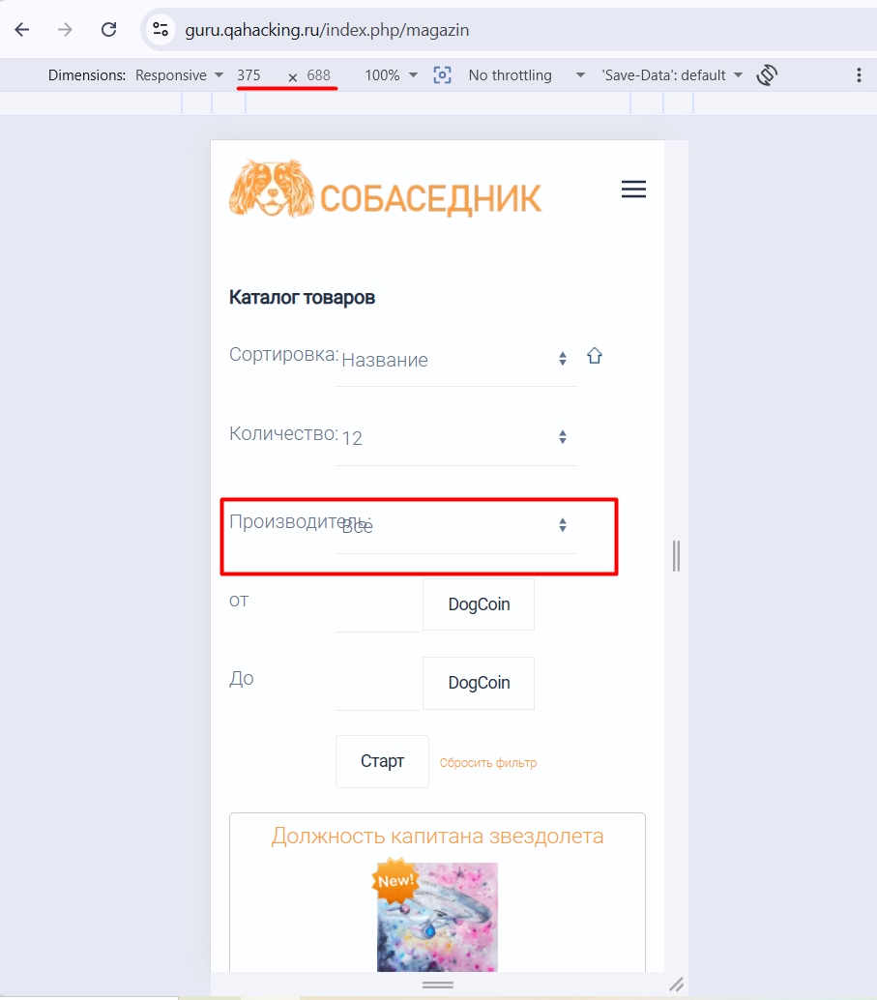
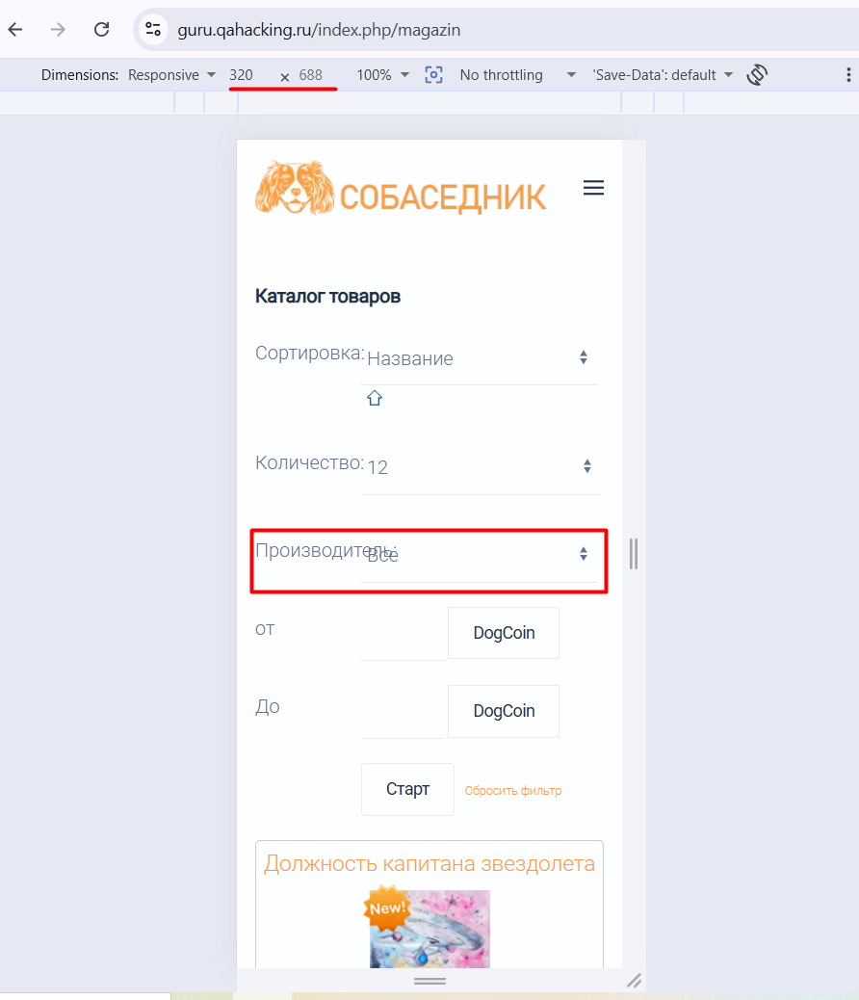

# BR-02: Наложение текста плейсхолдеров на названия вариантов сортировки в разделе «Магазин»

**Серьёзность:** Major

**Приоритет:** Medium

**Страница:** Магазин

**Стенд:** https://guru.qahacking.ru/index.php/magazin

**Окружение:** Windows 10 IoT Корпоративная LTSC (21H2), Chrome 150.0.7871.101 (64 бит), 1920px, 1366px, 768px, 375px, 320px

**Jira:** UFBH-5

## Шаги воспроизведения

1. Открыть раздел «Магазин» — https://guru.qahacking.ru/index.php/magazin
2. Посмотреть на блок сортировки вверху страницы

## Ожидаемый результат

Тексты плейсхолдеров полей сортировки не перекрывают названия вариантов сортировки. Элементы отображаются корректно и не перекрывают друг друга.

## Фактический результат

Тексты плейсхолдеров полей сортировки накладываются на названия вариантов сортировки, из-за чего текст отображается некорректно.

## Скриншоты

Скриншот из Jira:

Блок сортировки — наложение плейсхолдеров:

