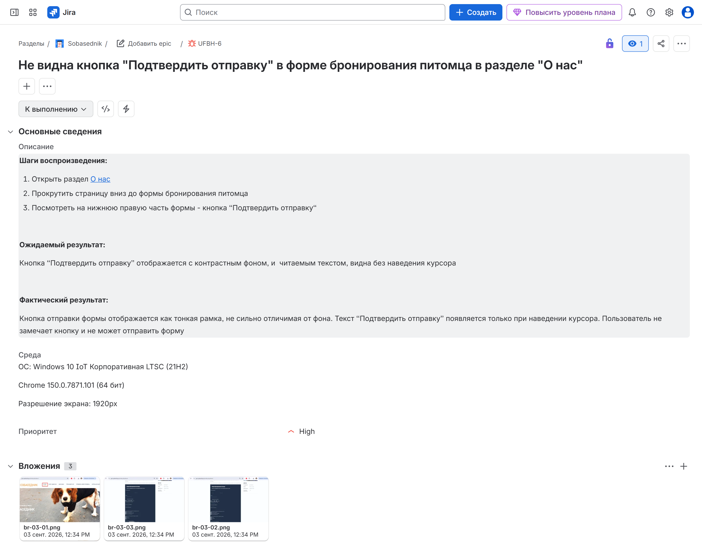
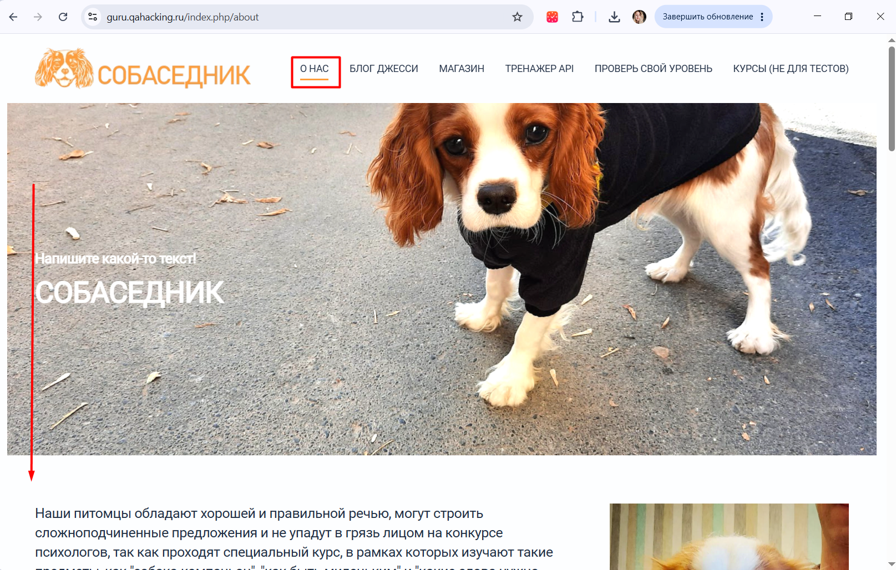
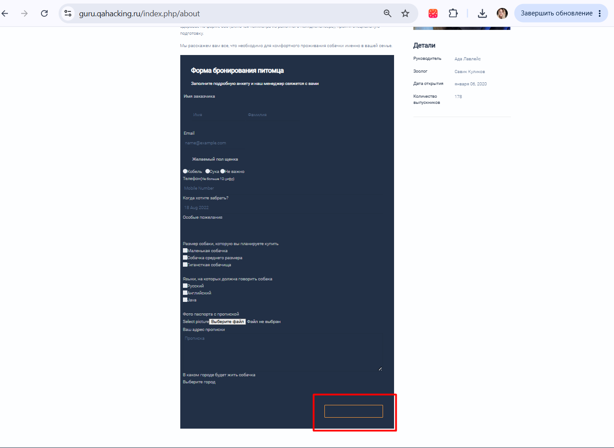
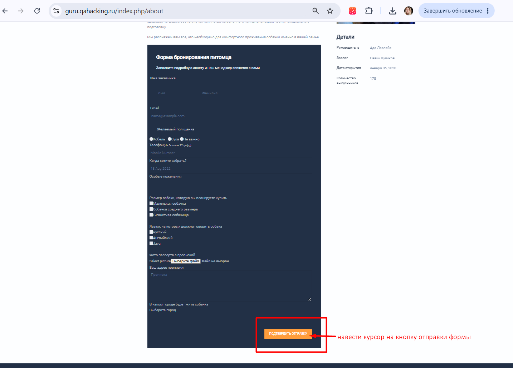

# BR-03: Не видна кнопка «Подтвердить отправку» в форме бронирования питомца в разделе «О нас»

**Серьёзность:** Critical

**Приоритет:** High

**Страница:** О нас — Форма бронирования питомца

**Стенд:** https://guru.qahacking.ru/index.php/about

**Окружение:** Windows 10 IoT Корпоративная LTSC (21H2), Chrome 150.0.7871.101 (64 бит), 1920px

**Jira:** UFBH-6

## Шаги воспроизведения

1. Открыть раздел «О нас» — https://guru.qahacking.ru/index.php/about
2. Прокрутить страницу вниз до формы бронирования питомца
3. Посмотреть на нижнюю правую часть формы — кнопка «Подтвердить отправку»

## Ожидаемый результат

Кнопка «Подтвердить отправку» отображается с контрастным фоном и читаемым текстом, видна без наведения курсора.

## Фактический результат

Кнопка отправки формы отображается как тонкая рамка, не сильно отличимая от фона. Текст «Подтвердить отправку» появляется только при наведении курсора. Пользователь не замечает кнопку и не может отправить форму.

## Скриншоты

Скриншот из Jira:

Страница «О нас» — форма внизу страницы:

Кнопка не видна — только тонкая рамка:

При наведении курсора — появляется текст:

